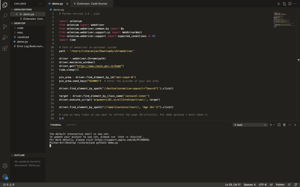

# CoWin App Vaccination Slot Status : Real Time Dashboard

# Hello, folks! 

The python code helps you minimize the monotonous task of continuously refreshing the CoWin app. All you need to do is update your pincode and the frequency with  which you want the CoWin page to be refreshed eg 5 for 5 sec and so on. 

The code takes you to the CoWin application and shows you the nearest availabe locations and acts as a real time dashboard and helps you monitor available vaccination slots by automaticall refreshing.

You can use the code on your personal systems Windoes / Linux / Mac OS by following the steps below :

1. Install python 3 latest version.
2. Install pip3
3. Install Selenium using pip3 : https://pypi.org/project/selenium/
4. Download Chrome WebDriver according to your version of Chrome.
5. Execute this code in any code editor compatible with Python eg: VS Code etc.

There you go !! Stay updated with the status of slot's nearest to you.

Note : This code does not provide an end-to-end vaccination booking facility but provides real time vaccination slot availability status.

# Demo

